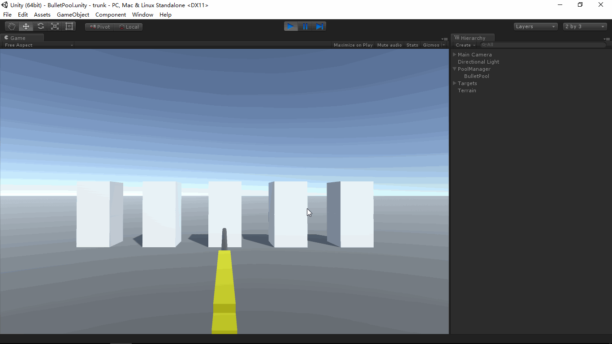

# MGS.ObjectPool

## Summary
- Game object pool for Unity project develop.

## Environment
- Unity 5.0 or above.
- .Net Framework 3.5 or above.

## Platform
- Windows.

## Demand
- Create pool for reusable game object.
- Create, Find and Delete pool by manager.

## Implemented
- GOPool: Pool of gameobject.
- GOPoolManager: Manager of gameobject pool.

## Usage

1. Create game object pool.

   ```c#
   //The prefab as template of reusable game object.
   var pool = GOPoolManager.Instance.CreatePool(poolName, prefab);
   ```

1. Use pool to Take, Recycle game object.

   ```C#
   //Use pool name to find the instance of pool from manager if we do not hold it.
   var pool = GOPoolManager.Instance.FindPool(poolName);
   
   //Take a game object same as prefab.
   var go = pool.Take();
   
   //Recycle the game object to pool if we do not need it.
   pool.Recycle(go);
   
   //Take a game object and get or add component.
   var cpnt = pool.Take<Bullet>();
   
   //Recycle the game object of component to pool if we do not need it.
   pool.Recycle(cpnt);
   ```

- Use GenericPool for Custom object.

  ```C#
  //Implement custom object.
  public class CustomObject : IResettable
  {
      public void Reset()
      {
          //Reset the object.
      }
  
      public void Dispose()
      {
          //Dispose the object.
      }
  }
  
  //Use GenericPool in your class.
  public class TestCase
  {
      public TestCase()
      {
          //Create pool for CustomObject.
          var pool = new GenericPool<CustomObject>();
  
          //Take a instance of CustomObject from pool.
          var obj = pool.Take();
  
          //Recycle object to pool if we do not need it.
          pool.Recycle(obj);
      }
  }
  ```

## Demo
- Demos in the path "MGS.Packages/ObjectPool/Demo/" provide reference to you.

## Preview


------

Copyright © 2021 Mogoson.	mogoson@outlook.com